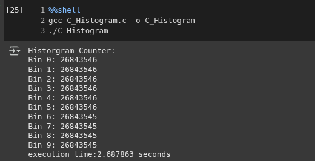
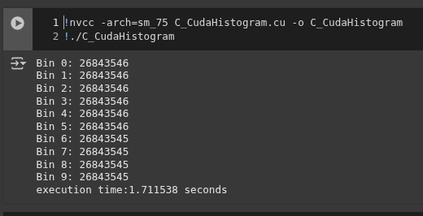
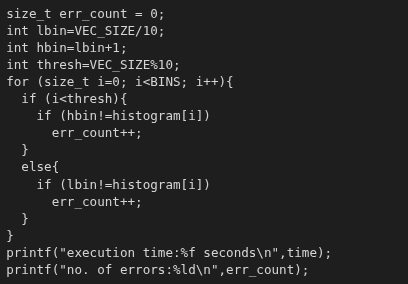
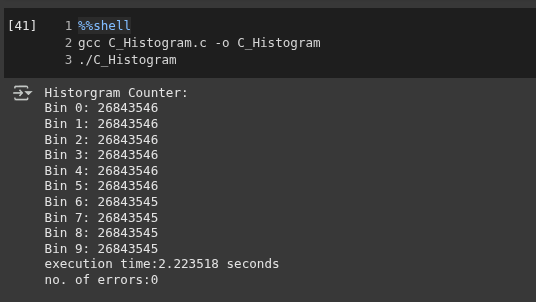
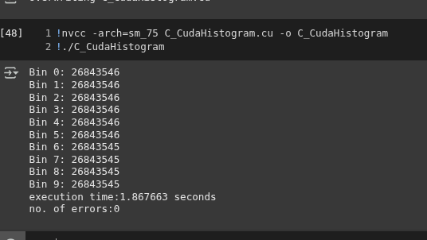

# Histogram Counting
#### Memebers:
- Abdul Raafi M. Bandrang
- Dennis Paulo S. Delgado

**CUDA concept video**: [link](https://youtu.be/wEXMjWJNbd4)
## Execution times 
C Execution             |  CUDA Execution
:-------------------------:|:-------------------------:
  |  
## Correctness check (C)
Based on a sequence of 0...N-1 where N is the array size
Correctness Check             |  C Execution
:-------------------------:|:-------------------------:
  |  
## Correctness check (CUDA)
Based on a sequence of 0...N-1 where N is the array size,
Correctness Check             |  CUDA Execution
:-------------------------:|:-------------------------:
  |  
## Performance  Analysis
**Runtimes in seconds**
|Run|C Execution time|CUDA Execution time|Run|C Execution time|CUDA Execution time|Run|C Execution time|CUDA Execution time|
|--|--|--|--|--|--|--|--|--|
1|2.214624 |1.708912|11|2.202794 |1.776193|21|2.197898 |1.648395|
2|2.238716 |1.643663|12|2.213818 |1.626385|22|2.205885 |1.670149|
3|2.200602 |1.747311|13|2.203160 |1.634932|23|2.210731 |1.676327|
4|2.694822 |1.818090|14|2.493078 |1.650545|24|2.217466 |1.752822|
5|2.212267 |1.644151|15|2.292633 |1.657738|25|2.625715 |1.792196|
6|2.196411 |1.643448|16|2.208325 |1.662367|26|2.199572 |1.662551|
7|2.203299 |1.640953|17|2.196955 |1.770837|27|2.209313 |1.674336|
8|2.193172 |1.609790|18|2.206388 |1.714365|28|2.213637 |1.661690|
9|2.656205 |1.628516|19|2.375831 |1.642696|29|2.197803 |1.712766|
10|2.252391 |1.702617|20|2.429471 |1.654965|30|2.692892 |1.638753|
Average|2.295196 |1.682282|

Based on the analysis of the runtimes of both the C program and the CUDA program, we identify that there is performance gain of 1.36x for CUDA program(inclusive of the overhead memory allocation and data transfer). This performance gain is most likely due to the C program running sequentially whilst the CUDA program utilizes 256 threads that to are able to run in parallel. 

## Problems encountered
We struggled with getting the threads to update the bins properly as we haven't implemented the actual atomicadd operation.  The aha moment is learning that atomic operations are a way for the threads to acquire the locks to the memory and signal that the address they had a lock to was going to be updated by them and then passed to the next thread.
